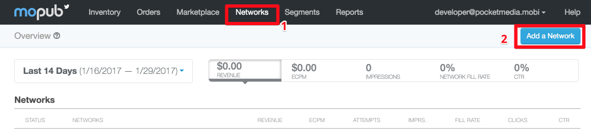
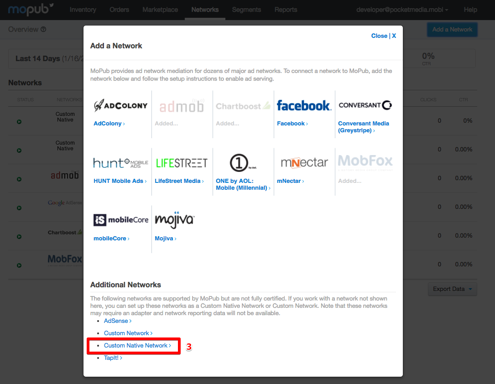
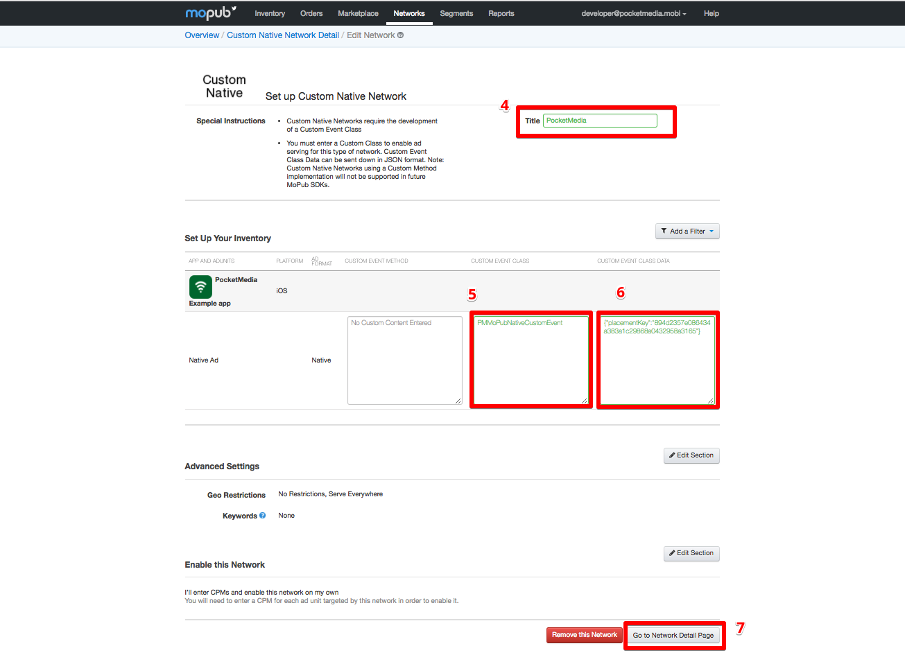
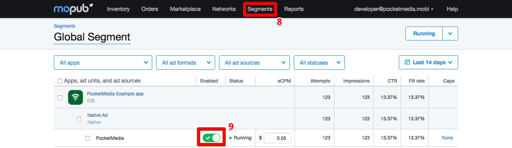
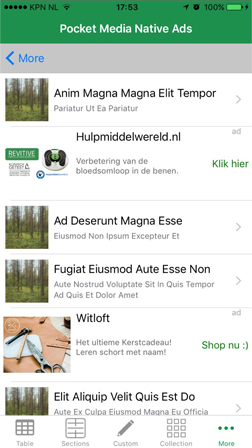

# MoPub integration
The MoPub SDK can mediate any native ad network SDK through their adapters and custom events capabilities. As a developer, this allows you to serve ads from multiple networks through the MPNativeAd interface. Instructions for integrating MoPub Native Ads can be found [here](https://github.com/mopub/mopub-ios-sdk/wiki/Native-Ads-Integration) 

Pocket Media has developed these adapters and thus offers 'plug-and-play' solution. To set these integrations up, follow these instructions.

> Note: these instructions assume you have already successfully [integrated the MoPub SDK](Getting-Started).

## Contents
* [1. Setup SDK](#1-setup-sdk)
* [2. Setup Mopub Dashboard](#2-setup-mopub-dashboard)
* [3. Native ad Units](#3-native-ad-units)
* [4. Ready to GO!](#4-ready-to-go)
* [Troubleshooting](#troubleshooting)

### 1. Setup SDK

> Note: See our Example app for a full feldged example integration with MoPub.

1. Clone the `nativeadslib-ios` repo.
    * Go into your terminal and type `git clone https://github.com/Pocketbrain/nativeadslib-ios.git`

2. Add the following files (located in the repo you just cloned):
    * `PocketMediaNativeAdsExample/AdapterIntegration/MoPub/Adapter/PMMoPubNativeAdAdapter.swift`
    * `PocketMediaNativeAdsExample/AdapterIntegration/MoPub/Adapter/PMMoPubNativeCustomEvent.swift`       
to your Xcode project.

3. Using [CocoaPods](http://cocoapods.org/) install the PocketMedia library.
Simply add the following line to your Podfile:

	* ```ruby pod "PocketMediaNativeAds"```

4. Then run the following in your terminal: 
	* ```ruby pod install```

5. You have to inform the MoPub SDK about this new possibility. You do this by adding ```PMMoPubNativeCustomEvent``` to the array of supportedCustomEvents.

	```swift
		...
	    let staticConfiguration = MPStaticNativeAdRenderer.rendererConfiguration(with: staticSettings)
	    staticConfiguration?.supportedCustomEvents = ["PMMoPubNativeCustomEvent"]
		
	    // Setup the ad placer.
	    placer = MPTableViewAdPlacer(tableView: tableView, viewController: self, rendererConfigurations: [staticConfiguration as Any])
	    placer.loadAds(forAdUnitID: "{{MOPUB AdUnitID}}")
	    ...
	```
	
===

### 2. Setup Mopub Dashboard

Create an "PocketMedia" `Network` in Mopub's dashboard and connect it to your Ad Units.

* In Mopub's dashboard select `Networks`  > `Add New network`



* Then select `Custom Native Network`



* Complete the fields accordingly to the Ad Unit that you want to use



5. Under `CUSTOM EVENT CLASS` copy and paste: "PMMoPubNativeCustomEvent"
6. Under `CUSTOM EVENT CLASS DATA` copy and paste your placement key in json:

```json
{"placementKey":"894d2357e086434a383a1c29868a0432958a3165"}
```
> You get a placement key from the [Pocket Media user dashboard](http://third-party.pmgbrain.com/)

* Under `segments` enable PocketMedia as a provider.



Your app should now be able to present Pocket Media's native advertisements. If you have any questions don't hesitate to [contact us](mailto:support@pocketmedia.mobi).

